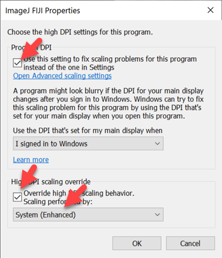

IJ-Plugins Bundle
=================

This project is used to create distribution bundle of the [IJ-Plugins] for [ImageJ] and [FIJI]/[ImageJ 2].

The bundle contains projects:

* [IJP-Toolkit] - the original core of the IJ-Plugins. Enables image segmentation (k-means, Seeded Region Growing),
  reading/writing 2D formats (MetaImage, VTK), color conversion (XYZ, L\*a\*b\*, YCrCb), color/band measurement, very
  fast median, various anisotropic diffusion filters, texture synthesis.
* [IJP-Color] - Color calibration/standardization using color charts and operations on color spaces.
* [IJP-DeBayer2SX] - Demasaicing (Bayer patter reconstruction) of raw images for better control over captured image
  color and detail quality.
* [IJP-ImageIO] - extends support for reading and writing images using codes implemented by Java ImageIO, for instance,
  writing compressed TIFF.

Installation
------------

### ImageJ

For [ImageJ] the IJ-Plugins Bundle is provide as a ZIP file on the [Releases] page. The ZIP is specific to your
operating system. For instance for Windows 10, the name will end with "-win". To install unzip the bundle, for
instance "ij-plugins_1.0.0-win.zip", in the ImageJ's plugins folder, it will create a folder named `ij-plugins`, and
restart ImageJ.

_Note_: all individual projects can be installed separately, see their respective Releases pages. The bundle is intended
to help to install all of them at once and remove mixed dependent JAR collisions.

### FIJI

In [Fiji]/[ImageJ 2] the IJ-Plugins Bundle can be installed through
the [IJ-Plugins Update Site]: "https://sites.imagej.net/IJ-Plugins/"

Steps:

1. Select `Help` > `Update` and wait for update to finish.
2. Click on `Manage update sites`.
3. Click on `Add update site`.
4. Under `Name` type "IJ-Plugins", under `URL` type "https://sites.imagej.net/IJ-Plugins/". Make sure that the check box
   next to the name "IJ-Plugins" is selected. Click `Close`
5. Click on `Apply changes`
6. Restart ImageJ

Tips and Troubleshooting
------------------------

### Use Java 11 or Newer

IJ Plugins expect to tun with current Java distribution, version 11 or newer. While effort is made to support obsolete
Java 8 used by FIJI/ImageJ 2 distribution, some plugins may not work correctly. Please
see [FIJI/ImageJ 2 FAQ][FIJI Running FAQ] for the steps to use newer version of Java.

### Java 8 Warning

If you FIJI installation is using the default (for FIJI) Java 8. You may get warning when using `IJP Color Calculator`
or `IJP Color Calibrator` plugins that may look something like this:

```
... javafx.fxml.FXMLLoader$ValueElement processValue
WARNING: Loading FXML document with JavaFX API of version 10.0.1 by JavaFX runtime of version 8.0.172
```

In general this should not impact operation of plugins. If possible, it is better to use Java 11 or newer. Please
see [FIJI/ImageJ 2 FAQ][FIJI Running FAQ] for steps to use newer version of Java.

Note as tested on 2023-04-23:

* Use new experimental launcher: https://imagej.net/learn/launcher - tested
  with `imagej-launcher-6.0.3-20220914.012819-46-win64.exe`
* Download JRE 17, for instance from here: https://www.azul.com/downloads/#zulu. Installation should be
  in `java/win64/<name>/jre`, for instance, `java/win64/zulu11.62.17-ca-jre11.0.18-win_x64/jre`. You may need to
  create `jre` by hand and move content there (`bin`, `conf` `legal`, `lib`, ...)

### Tip: ImageJ main window may shrink when using some plugins on Windows 10

When using `IJP Color Calculator` or `IJP Color Calibrator` plugins the main ImageJ window may shrink (change size) if
your monitor is using scaling other than 100%. This may also happen to other windows opened by ImageJ. If that happens:

1. In Windows Explorer, go to your FIJI installation directory
2. Right click on `ImageJ-win64.exe` and select "Properties"
3. Select "Compatibility" tab and click on "Change high DPI settings"
4. Select two check marks and select "System (Enhanced)" as indicated in the image below, click "OK", then restart FIJI




[Releases]: https://github.com/ij-plugins/ij-plugins-bundle/releases

[IJ-Plugins Update Site]: https://sites.imagej.net/IJ-Plugins/

[ImageJ]:         https://imagej.nih.gov/ij/

[ImageJ 2]:       http://imagej.net

[FIJI Running FAQ]: https://imagej.net/Frequently_Asked_Questions.html#How_do_I_launch_ImageJ_with_a_different_version_of_Java.3F

[FIJI]:           https://imagej.net/Fiji

[IJ-Plugins]:     https://github.com/ij-plugins

[IJP-Color]:      https://github.com/ij-plugins/ijp-color

[IJP-DeBayer2SX]: https://github.com/ij-plugins/ijp-DeBayer2SX

[IJP-ImageIO]:    https://github.com/ij-plugins/ijp-imageio/wiki

[IJP-Toolkit]:    https://github.com/ij-plugins/ijp-toolkit/wiki